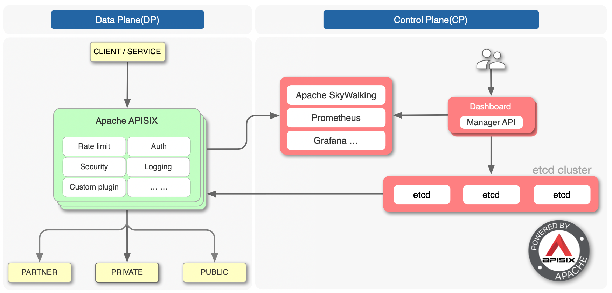

<!--
#
# Licensed to the Apache Software Foundation (ASF) under one or more
# contributor license agreements.  See the NOTICE file distributed with
# this work for additional information regarding copyright ownership.
# The ASF licenses this file to You under the Apache License, Version 2.0
# (the "License"); you may not use this file except in compliance with
# the License.  You may obtain a copy of the License at
#
#     http://www.apache.org/licenses/LICENSE-2.0
#
# Unless required by applicable law or agreed to in writing, software
# distributed under the License is distributed on an "AS IS" BASIS,
# WITHOUT WARRANTIES OR CONDITIONS OF ANY KIND, either express or implied.
# See the License for the specific language governing permissions and
# limitations under the License.
#
-->

# Apache APISIX Dashboard

[](https://github.com/apache/apisix-dashboard/blob/master/LICENSE)
[](https://goreportcard.com/report/github.com/apache/apisix-dashboard)
[](https://hub.docker.com/r/apache/apisix-dashboard)
[](https://www.cypress.io/)
[](https://apisix.apache.org/slack)

<p align="center">
  <a href="https://apisix.apache.org/">Website</a> •
  <a href="https://github.com/apache/apisix/tree/master/docs">Docs</a> •
  <a href="https://twitter.com/apacheapisix">Twitter</a>
</p>

- The master version should be used with Apache APISIX master version.

- The latest released version is [3.0.1](https://apisix.apache.org/downloads/) and is compatible with [Apache APISIX 3.0.x](https://apisix.apache.org/downloads/).

## What's Apache APISIX Dashboard

The Apache APISIX Dashboard is designed to make it as easy as possible for users to operate [Apache APISIX](https://github.com/apache/apisix) through a frontend interface.

The Dashboard is the control plane and performs all parameter checks; Apache APISIX mixes data and control planes and will evolve to a pure data plane.

Note: Currently the Dashboard does not have complete coverage of Apache APISIX features, [visit here](https://github.com/apache/apisix-dashboard/milestones) to view the milestones.



## Demo

[Online Playground](https://apisix-dashboard.apiseven.com/)

```text
Username: admin
Password: admin
```

## Works with APISIX Ingress Controller

Currently, APISIX Ingress Controller automatically manipulates some APISIX resources, which is not very compatible with APISIX Dashboard. In addition, users should not modify resources labeled `managed-by: apisix-ingress-controllers` via APISIX Dashboard.

## Project structure

```text
.
├── CHANGELOG.md
├── CODE_OF_CONDUCT.md
├── CONTRIBUTING.md
├── Dockerfile
├── LICENSE
├── Makefile
├── NOTICE
├── README.md
├── api
├── docs
├── licenses
└── web
```

1. The `api` directory is used to store the `Manager API` source codes, which is used to manage `etcd` and provide APIs to the frontend interface.
2. The `web` directory is used to store the frontend source codes.

## Build then launch

Support the following ways currently.

- [Docker, RPM, Source Codes](./docs/en/latest/install.md)
- [Rebuild docker image](./docs/en/latest/deploy-with-docker.md)

## Development

Pull requests are encouraged and always welcome. [Pick an issue](https://github.com/apache/apisix-dashboard/issues?q=is%3Aopen+is%3Aissue+label%3A%22good+first+issue%22) and help us out!

Please refer to the [Development Guide](./docs/en/latest/develop.md).

## User Guide

Please refer to the [User Guide](./docs/en/latest/USER_GUIDE.md).

## Contributing

Please refer to the [Contribution Guide](./CONTRIBUTING.md) for a more detailed information.

## FAQ

Please refer to the [FAQ](./docs/en/latest/FAQ.md) for more known issues.

## License

[Apache License 2.0](./LICENSE)

1. etcd (Distributed Key-Value Store)
Lines:

Copy
tcp    LISTEN  0   4096  127.0.0.1:2379  0.0.0.0:*  users:(("etcd",pid=1542,fd=8))
tcp    LISTEN  0   4096  127.0.0.1:2380  0.0.0.0:*  users:(("etcd",pid=1542,fd=7))
Explanation:

Port 2379: etcd client communication port. APISIX uses this to read/write configuration data.

Port 2380: etcd peer communication port (for cluster node-to-node communication).

Both are bound to 127.0.0.1, meaning etcd is only accessible locally (not exposed externally).

2. APISIX (API Gateway)
Lines:

Copy
tcp  LISTEN  0  511  0.0.0.0:9443  0.0.0.0:*  users:(("openresty",pid=9898,fd=15), ...)
tcp  LISTEN  0  511  0.0.0.0:8000  0.0.0.0:*  users:(("openresty",pid=9898,fd=13), ...)
tcp  LISTEN  0  511  0.0.0.0:9180  0.0.0.0:*  users:(("openresty",pid=9898,fd=8), ...)
tcp  LISTEN  0  511  127.0.0.1:9090  0.0.0.0:*  users:(("openresty",pid=9898,fd=7), ...)
tcp  LISTEN  0  511  127.0.0.1:9091  0.0.0.0:*  users:(("openresty",pid=9901,fd=26))
Key Ports:

Port 9443: HTTPS traffic endpoint (default SSL port for APISIX).

Port 8000: HTTP traffic endpoint (default non-SSL port for APISIX).

Port 9180: Prometheus metrics endpoint (exposes APISIX metrics for monitoring).

Port 9090/9091: Admin API ports (used for configuring APISIX; 9090 is HTTP, 9091 is HTTPS).

Bound to 0.0.0.0, meaning APISIX accepts external traffic on these ports.

3. APISIX Dashboard (Management UI)
Line:

Copy
tcp  LISTEN  0  4096  *:9000  *:*  users:(("manager-api",pid=9729,fd=10))
Explanation:

Port 9000: APISIX Dashboard (manager-api) listens here for HTTP traffic.

Bound to all interfaces (*:9000), so the dashboard is accessible externally.

Summary
Component	Port	Purpose	Accessibility
etcd	2379	Client communication (config store)	Localhost only
2380	Peer communication (cluster)	Localhost only
APISIX	8000	HTTP API Gateway	External
9443	HTTPS API Gateway	External
9180	Prometheus metrics	External
9090	Admin API (HTTP)	Localhost only
9091	Admin API (HTTPS)	Localhost only
APISIX Dashboard	9000	Management UI/API	External
Notes
Security: Admin ports (9090, 9091) and etcd ports (2379, 2380) are localhost-only, which is a security best practice.

OpenResty: APISIX runs on OpenResty (a Lua-based NGINX extension), hence the openresty process name.

systemd-resolve/chronyd: These are unrelated to APISIX/etcd (system DNS/time services).